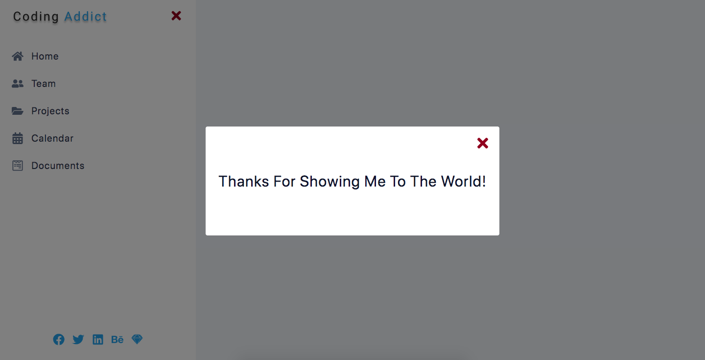

# Sidebar-Modal



## Project Description

**Sidebar-Modal** is a responsive `React` application that features a functional and stylish sidebar and modal. It provides a seamless user experience with smooth transitions and adaptability for both large and small screens. Built using `Vite` and `React.js`, this project showcases a well-designed and interactive sidebar component.

With **Sidebar-Modal**, users can enjoy a user-friendly and visually appealing navigation experience across different devices and screen sizes. The application's responsive design, smooth transitions, and functional menu options provide a seamless browsing experience.

## Important Links

- https://sidebarmodal-sm.netlify.app/

### Setup Steps

1. [Fork and Clone](https://github.com/iamatos3/sidebar-modal) this repository.
2. ```npm install```
3. ```npm run dev```

### Technologies Used

- Vite
- JavaScript
- React.js
- React Icons
- HTML
- CSS